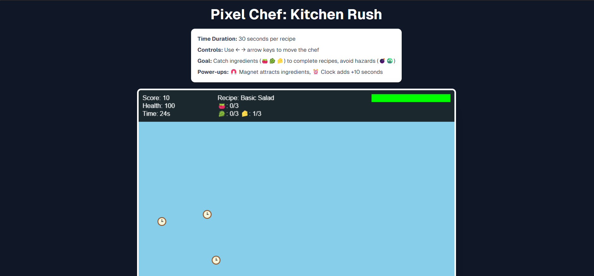
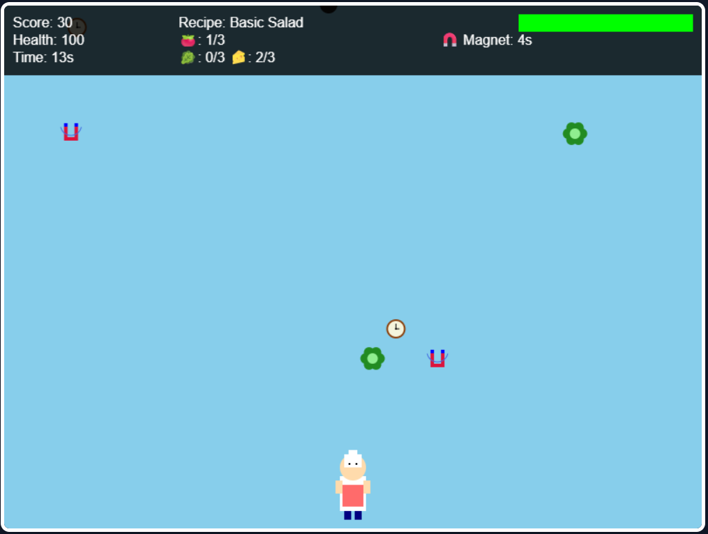

# Pixel Chef Game 🎮👨‍🍳  

A fun and interactive cooking-themed game built using **v0**.  
Catch ingredients, manage time, and challenge yourself with different time limits!  

---

## ✨ Features  
- 🎨 Improved visuals for the chef character  
- 🥕 Updated ingredient designs (new shapes & looks)  
- ⏰ Increased bonus time when catching the clock  
- 🕹️ Multiple game duration options:  
  - 30 seconds  
  - 1 minute  
  - 1.5 minutes  

---

## 🚀 How to Play  
1. Start the game and choose your desired time limit.  
2. Move the chef to catch falling ingredients.  
3. Catch clocks to gain extra time.  
4. Score as high as possible before time runs out!  

---

## 📸 Screenshots





## 🛠️ Installation & Setup  
```bash
# 1. Clone the repository
git clone https://github.com/Ganeshkaithoju/PIXEL-CHEF-GAME.git

# 2. Navigate to the project folder
cd PIXEL-CHEF-GAME

# 3. Install dependencies
npm install

# 4. Install Tailwind Merge (for styling improvements)
npm install tailwind-merge

# 5. Start the development server
npm run dev

# 6. Build the project for production
npm run build

# 7. Run the production build
npm start

# 8. Open your browser and go to
http://localhost:3000

---


